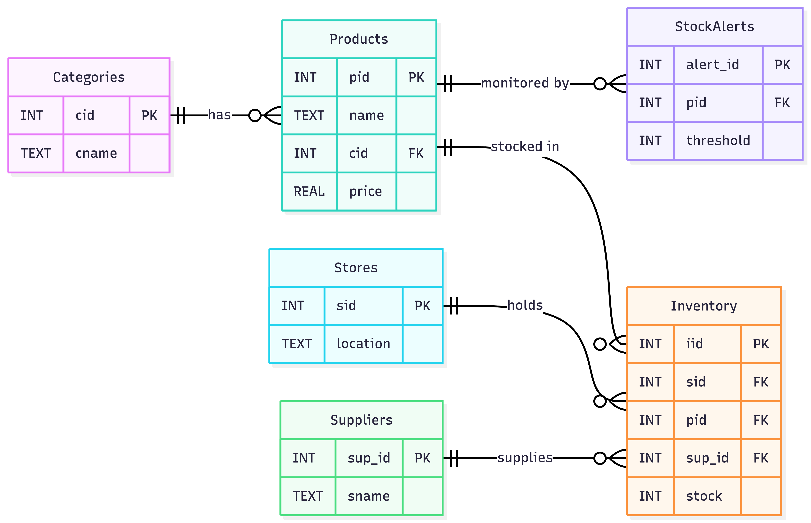

# Electronics Dark Store — Inventory Tracker

A modern desktop inventory management system for electronics dark stores, built with **Python**, **SQLite**, and **Tkinter**.  
Developed as a DBMS mini-project demonstrating relational schema design, foreign-key constraints, multi-table JOIN queries, and the MVC architectural pattern.

---

## Features

| Feature | Description |
|---|---|
| **Dashboard** | Real-time overview with stat cards, store breakdown, and category distribution |
| **Inventory Browser** | Filterable & searchable inventory table with color-coded stock levels |
| **Low Stock Alerts** | Configurable threshold scanner with critical/warning severity indicators |
| **Stock Editor** | Inline editing of stock quantities with validation |
| **Dark Theme UI** | Premium dark-mode interface with modern styling and hover effects |
| **MVC Architecture** | Clean separation of Models, Views, and Controllers |

---

## Project Structure

```
dms mini/
│
├── main.py                              # Entry point — run this file
│
├── config/                              # Configuration
│   ├── __init__.py
│   └── settings.py                      # DB path, dimensions, theme palette, fonts
│
├── models/                              # Data-Access Layer (all SQL lives here)
│   ├── __init__.py
│   └── database.py                      # Connection management, queries, CRUD
│
├── views/                               # UI Layer (Tkinter)
│   ├── __init__.py
│   ├── app_window.py                    # Main window shell + sidebar navigation
│   ├── dashboard_view.py                # Dashboard with stat cards & charts
│   ├── inventory_view.py                # Inventory table + filters + search + edit
│   ├── alerts_view.py                   # Low stock alerts with severity indicators
│   └── components.py                    # Reusable widgets (buttons, cards, nav)
│
├── controllers/                         # Business Logic
│   ├── __init__.py
│   └── inventory_controller.py          # Validation, formatting, orchestration
│
├── scripts/                             # Utilities
│   └── seed_db.py                       # Database seeder (standalone, reproducible)
│
├── data/                                # Data
│   └── electronics_darkstore.db         # SQLite database (auto-created on first run)
│
└── README.md                            # This file
```

---

The database contains **6 tables** with enforced foreign-key relationships:



### Seed Data

| Entity | Count | Examples |
|---|---|---|
| Categories | 5 | Laptops, Phones, Audio, Tablets, Gaming |
| Suppliers | 3 | Reliance Digital, Croma Retail, Amazon Wholesaler |
| Stores | 2 | Mumbai-Andheri, Bangalore-Whitefield |
| Products | 50 | MacBook Pro Gen-3, Samsung S24 Gen-1, PS5 Console Gen-2, … |

All data is generated with a **fixed random seed (42)** so results are fully reproducible.

---

## Setup & Installation

### Prerequisites

| Requirement | Version |
|---|---|
| Python | **3.10** or higher |
| sqlite3 | Included in stdlib |
| tkinter | Included in stdlib |

> **No `pip install` step is needed.** All dependencies are part of the Python standard library.

### Quick Start

```bash
# 1. Clone or download the repository
git clone <repo-url>
cd "dms mini"

# 2. Run the application (auto-seeds on first launch)
python main.py
```

That's it! The database is automatically created and seeded on the first run.

---

## Running the Application

```bash
python main.py
```

The GUI opens with the **Dashboard** view. Use the sidebar to navigate:

| View | Description |
|---|---|
| **Dashboard** | Overview cards showing total products, low stock count, store breakdown, inventory value |
| **Inventory** | Full inventory table — filter by store & category, search by name/supplier, edit stock |
| **Alerts** | Low-stock scanner — set a custom threshold to identify items needing restocking |

---

## Resetting the Database

To wipe and recreate the database with fresh seed data:

```bash
python scripts/seed_db.py
```

> **Warning:** This drops all existing tables and re-inserts the default data.

---

## Architecture (MVC Pattern)

```
                ┌──────────────────────────────────────┐
                │                 main.py              │
                │              (Entry Point)           │
                └──────────────────┬───────────────────┘
                                   │
                    ┌──────────────┼──────────────┐
                    │              │              │                        ▼              ▼              ▼
                ┌────────┐   ┌──────────┐   ┌─────────┐
                │ Views  │◄──│Controller│──►│  Models │
                │        │   │          │   │         │
                │ Tkinter│   │ Business │   │ SQLite  │                    │  GUI   │   │  Logic   │   │ Queries │
                └────────┘   └──────────┘   └─────────┘
```

- **Models** (`models/database.py`): Pure data-access — all SQL queries, connection management
- **Views** (`views/`): Tkinter UI widgets — no business logic or SQL
- **Controllers** (`controllers/inventory_controller.py`): Validation, formatting, orchestrating calls between Views and Models

---

## Key SQL Queries

### 4-Table JOIN (Inventory View)

```sql
SELECT p.pid, p.name, c.cname, i.stock, p.price, sup.sname
FROM   Inventory  i
JOIN   Products   p   ON i.pid    = p.pid
JOIN   Categories c   ON p.cid    = c.cid
JOIN   Stores     s   ON i.sid    = s.sid
JOIN   Suppliers  sup ON i.sup_id = sup.sup_id
WHERE  s.location = ?
ORDER BY c.cname, p.name
```

### Aggregate Query (Dashboard Stats)

```sql
SELECT COALESCE(SUM(i.stock * p.price), 0),
       COALESCE(AVG(i.stock), 0)
FROM   Inventory i
JOIN   Products  p ON i.pid = p.pid
```

### Low Stock Alert Query

```sql
SELECT p.pid, p.name, c.cname, s.location, i.stock, ? AS threshold
FROM   Inventory  i
JOIN   Products   p ON i.pid = p.pid
JOIN   Categories c ON p.cid = c.cid
JOIN   Stores     s ON i.sid = s.sid
WHERE  i.stock <= ?
ORDER BY i.stock ASC
```

---

## Module Reference

| Module | Purpose |
|---|---|
| `config/settings.py` | All constants: DB path, window size, colors, fonts, thresholds |
| `models/database.py` | Data-access layer with 10+ query functions |
| `controllers/inventory_controller.py` | Validation, price formatting (₹), stock status classification |
| `views/app_window.py` | Main window with sidebar navigation and view switching |
| `views/dashboard_view.py` | Dashboard with stat cards and distribution charts |
| `views/inventory_view.py` | Inventory table with filters, search, and stock editor |
| `views/alerts_view.py` | Low stock alerts with configurable threshold |
| `views/components.py` | Reusable widgets: StyledButton, StatCard, NavButton, SectionHeader |
| `scripts/seed_db.py` | Standalone seeder — drops & recreates all tables |

---

## 📄 License

This project was developed as an academic DBMS mini-project.
